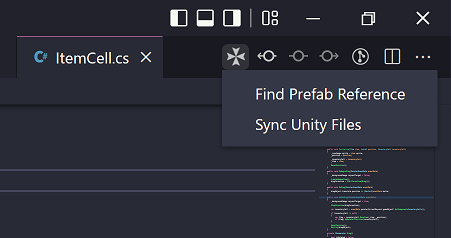
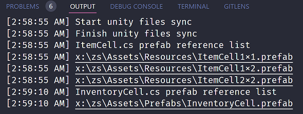

The Clover is clever vscode extension for unity developer.

---

# ToDo (prototype)

- [x] ~~add editor toolbar icon~~
- [x] ~~prefab reference check (.cs file)~~
- [ ] finder result view (not output)