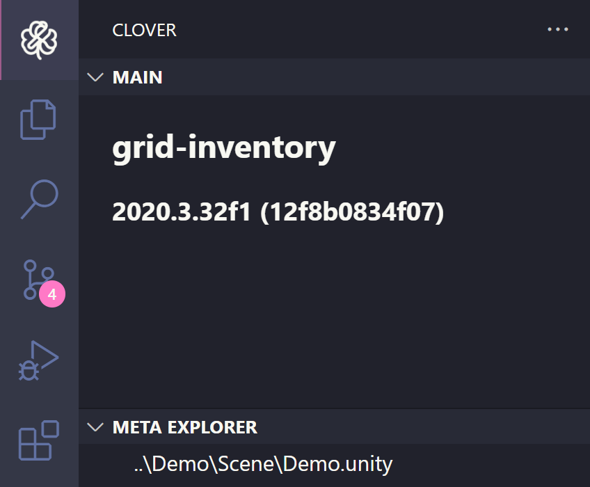
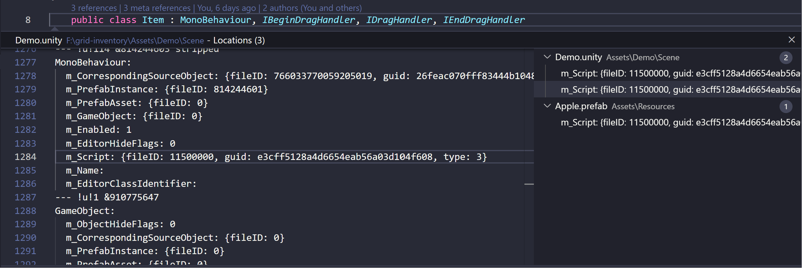

Clover is a powerful VSCode extension that helps you manage asset references within your unity project. With Clover, you can quickly find and manage asset references to ensure your code is efficient and well-organized.

The Asset References system in Clover makes it easy to see all the places where a particular asset is referenced in your project. You can quickly navigate to those locations to make changes or updates to your code. This helps you to avoid errors, improve efficiency, and save time.

Request and Ideas section where you can provide feedback and suggestions for future update, Whether you have a feature request or an idea for improving the extension, want to hear from you! Leave a comment on this repository issues tab.

## Meta Reference
### Activity Bar
You can check your project information, and meta reference on clover view.
Clover activity bar is only activate on Unity project.

### CodeLens
You can find meta references of the current .cs file using CodeLens.

