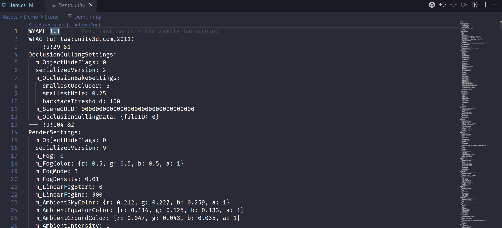

# Clover for Unity – VSCode Extension

Clover is a powerful VSCode extension for unity project. With Clover, you can quickly find and manage asset references to ensure your code is efficient and well-organized.

The Asset References system in Clover makes it easy to see all the places where a particular asset is referenced in your project. You can quickly navigate to those locations to make changes or updates to your code. This helps you to avoid errors, improve efficiency, and save time.

Also Clover is support much more Unity utilities.

Request and Ideas section where you can provide feedback and suggestions for future update, Whether you have a feature request or an idea for improving the extension, want to hear from you! Leave a comment on this repository issues tab.

## Meta Reference
You can find meta references of the current .cs file using CodeLens.

## Method Usage
You can track easily where methods are used in.

## Unity Event Functions Summary
Display unity built-in event functions summary and documentation link to navigate to the Unity official documentation.

## Unity Asset Viewer (Experimental)
You can check your prefab, scene file in VSCode.

## Unity Asset Explorer
Unity scene, prefab file explorer

## Snippets
Support unity code snippets.

## Attribute Helper
You can find unity attributes.

